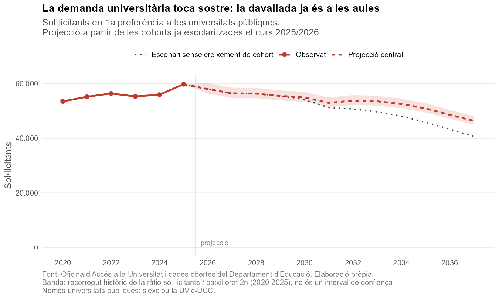

<!--
Secció candidata per a report.qmd — encara NO s'hi inclou.

Generada a partir de:
  Rscript 02-code/build_matriculats.R   -> 04-output/alumnes_per_ensenyament_nivell.csv
  Rscript 02-code/build_forecast.R      -> 04-output/projeccio_demanda.csv
                                           04-output/figures/fig_projeccio.png

Les xifres d'aquest text són estàtiques: si es torna a executar la projecció amb
dades noves, cal actualitzar-les (o convertir-les en codi R en línia en passar el
fitxer a .qmd). Per incloure-la a l'informe:  

Dades de referència: sol·licitants observats 2020-2025 (OAU) i cohorts escolars
del curs 2025/2026 (dades obertes del Departament d'Educació i FP).
-->

## 5. I ara? La demanda ja ha tocat sostre

Fins aquí hem mirat enrere. Però hi ha una pregunta que les mateixes dades permeten
respondre mirant endavant, i amb una seguretat poc habitual en qualsevol projecció:
**qui sol·licitarà plaça d'aquí a dotze anys ja és a l'escola avui**. No cal predir
quanta gent naixerà: n'hi ha prou de comptar quants alumnes hi ha ara a cada curs i
seguir-los.

I el que es veu quan es compten és inequívoc. **El primer curs de primària ha passat de
80.841 alumnes el 2015 a 63.649 el 2025: un 21% menys.** Aquesta davallada encara no ha
arribat a la universitat —els cursos plens són ara a l'ESO i al batxillerat—, però hi
arribarà, i sabem exactament quan.



La projecció situa el **màxim de demanda al 2025**, l'últim any observat. A partir d'aquí,
un descens sostingut: cap al **2031 el sistema torna al nivell de sol·licitants del 2020**,
s'hi manté un parell d'anys i, a partir del 2034, cau cap a un terreny que no s'havia vist.

### L'evolució, any per any

| Any | | Sol·licitants | vs 2020 | vs 2025 | Índex (2020=100) | Recorregut |
|---|---|---:|---:|---:|---:|---:|
| 2020 | observat | 53.545 | — | −10,5% | 100,0 | |
| 2021 | observat | 55.221 | +3,1% | −7,7% | 103,1 | |
| 2022 | observat | 56.431 | +5,4% | −5,7% | 105,4 | |
| 2023 | observat | 55.341 | +3,4% | −7,5% | 103,4 | |
| 2024 | observat | 55.981 | +4,5% | −6,4% | 104,5 | |
| **2025** | **observat — màxim** | **59.824** | **+11,7%** | — | **111,7** | |
| 2026 | projecció ◆ | 58.031 | +8,4% | −3,0% | 108,4 | 56.338–60.176 |
| 2027 | projecció | 56.470 | +5,5% | −5,6% | 105,5 | 54.822–58.557 |
| 2028 | projecció | 56.359 | +5,3% | −5,8% | 105,3 | 54.714–58.442 |
| 2029 | projecció | 55.521 | +3,7% | −7,2% | 103,7 | 53.901–57.573 |
| 2030 | projecció | 54.967 | +2,7% | −8,1% | 102,7 | 53.363–56.998 |
| 2031 | projecció | 53.004 | −1,0% | −11,4% | 99,0 | 51.457–54.963 |
| 2032 | projecció | 53.825 | +0,5% | −10,0% | 100,5 | 52.254–55.814 |
| 2033 | projecció | 53.569 | +0,0% | −10,5% | 100,0 | 52.006–55.549 |
| 2034 | projecció | 52.577 | −1,8% | −12,1% | 98,2 | 51.043–54.520 |
| 2035 | projecció | 50.961 | −4,8% | −14,8% | 95,2 | 49.474–52.844 |
| 2036 | projecció | 48.607 | −9,2% | −18,8% | 90,8 | 47.189–50.404 |
| 2037 | projecció | 46.404 | −13,3% | **−22,4%** | 86,7 | 45.050–48.119 |

◆ El 2026 surt d'alumnes que ja són a batxillerat 2n: no hi intervé cap ràtio de progressió.
El recorregut és el rang històric observat de la ràtio de conversió, **no** un interval de
confiança.

Val la pena fixar-se en tres coses que la columna «vs 2020» deixa veure i que el titular
amaga:

- **La caiguda arriba tard.** Fins al 2033 el sistema es manté al nivell del 2020 o per
  damunt. Més de la meitat del descens total es concentra en els quatre últims anys
  (2034–2037). Res no sembla dramàtic fins que ho és.
- **El 2032 repunta.** No és soroll: els sol·licitants d'aquell any surten de l'actual 6è de
  primària, una cohort una mica més gran que la de 1r d'ESO que alimenta el 2031.
- **El descens és gradual, no un salt.** Entre el 2026 i el 2030 la demanda baixa un 1,4%
  anual: prou lentament perquè cada any sembli el d'abans, i prou de pressa perquè en una
  dècada el panorama sigui un altre.

### Això obliga a rellegir tot el que hem vist

Hi ha un càlcul que canvia el sentit dels apartats anteriors. Entre el 2020 i el 2025 els
sol·licitants van créixer un **11,7%**; la cohort de 4t d'ESO de la qual surten, tres anys
abans, havia crescut un **18,6%**. La demanda, doncs, **va créixer menys que la població que
la genera**: la proporció d'una cohort que acaba demanant plaça a la pública va caure prop
d'un 6%.

Ara bé, això no vol dir que estudiar hagi perdut atractiu, i val la pena separar les dues
coses perquè apunten en direccions diferents:

- **Menys alumnes fan batxillerat.** La ràtio d'ESO 4t a batxillerat 1r va de 0,704 (2015) a
  0,596 (2024): el desviament cap a la FP explica pràcticament tota la caiguda anterior.
- **Els qui el fan, demanen plaça igual o més.** Entre els qui acaben batxillerat, la
  proporció que sol·licita plaça va **pujar** un 2,8% en el mateix període.

La conclusió és que el creixement de la demanda dels apartats 1 i 2 **era demografia**: una
onada de cohorts grosses travessant el sistema. El canvi de comportament no va ser a la
porta de la universitat, sinó abans, al moment de triar entre batxillerat i FP. I les onades
demogràfiques, a diferència de les modes, passen amb puntualitat.

Això connecta amb la cadena causal de l'informe pel seu extrem. Si la pressió sobre les
notes de tall va pujar perquè molta més gent es disputava les mateixes places, és raonable
esperar que **una demanda a la baixa n'alleugereixi una part**, si l'oferta es manté tan
plana com fins ara. Amb quina intensitat, i a quin ritme, és una altra qüestió: la nota de
tall depèn de com es reparteix la demanda estudi per estudi, i no només del total agregat
que projectem aquí. Els graus més sol·licitats poden mantenir el llistó alt encara que el
conjunt del sistema es relaxi.

Sigui com sigui, el que sí que sembla que canvia és el marc de la discussió. Durant una
dècada la pregunta ha estat com absorbir una demanda creixent; **la dècada que ve tindrà
més aviat la forma contrària**, la d'un sistema dimensionat per a una onada que ja hauria
passat. Val la pena tenir-ho present a l'hora de llegir el que hem vist als apartats
anteriors, encara que quines conseqüències se n'hagin de treure quedi fora de l'abast
d'aquest informe.

### Nota metodològica de la projecció

El model segueix les cohorts reals pel seu trajecte escolar i les converteix en
sol·licitants al final:

```
nivell actual --(ràtios de progressió)--> batxillerat 2n --(ràtio de conversió)--> sol·licitants
```

- **Ràtios de progressió de cohort**: alumnes al nivell següent l'any següent dividit pels
  alumnes al nivell actual. Recullen de cop repetició, abandonament i migració neta. Dins de
  primària i ESO són molt estables (desviació 0,007–0,023) i s'hi pren la mitjana dels 5
  anys recents.
- **Ràtio de conversió**: sol·licitants de l'any *T* per cada alumne de batxillerat 2n del
  curs *T−1*. És d'**1,21** de mitjana (recorregut 1,18–1,26). Val més d'1 perquè als
  sol·licitants s'hi sumen les altres vies d'accés —sobretot CFGS— i qui repeteix
  convocatòria.
- **Abast**: universitats públiques, amb el mateix criteri que la resta de l'informe
  (s'exclou la UVic-UCC). Els alumnes surten de primària, ESO i batxillerat ordinaris;
  l'educació d'adults i l'especial en queden fora.

**Per què es projecta passant pel batxillerat.** Es van provar dos models. El de batxillerat
2n té una ràtio de conversió plana (pendent no significatiu, p = 0,83). L'alternativa
—projectar directament des d'ESO 4t— té una deriva a la baixa apreciable (p = 0,07), perquè
la seva ràtio absorbeix silenciosament la caiguda del pes del batxillerat. En proves
*walk-forward*, estimant la ràtio només amb anys anteriors al que es prediu, l'error mitjà
és del **3,2%** amb el model de batxillerat i del **4,6%** amb el d'ESO 4t. La projecció de
cohorts, tota sola, encerta entre **−1,7% i +2,7%** a horitzons de 3 a 8 anys.

**On és la incertesa.** No en la demografia. Els alumnes que sostenen la demanda fins al
2028 ja estan comptats al curs 2025/2026. El que s'ha de suposar és la part del trajecte que
els queda, i hi pesen dos supòsits:

- **Cada cop menys alumnes trien batxillerat**: la ràtio d'ESO 4t a batxillerat 1r ha caigut
  de 0,704 (2015) a 0,596 (2024), en favor de la FP. Es fixa en el darrer valor observat en
  comptes d'extrapolar-ne la caiguda dotze anys enllà, i també perquè una part dels qui van
  a FP tornen al sistema universitari per la via dels CFGS —que la ràtio de conversió ja
  recull. Si la fugida cap a la FP continua, el batxillerat encongirà més del que diu la
  projecció, però l'efecte net sobre el total de sol·licitants és més esmorteït.
- **Les cohorts guanyen efectius pel camí**: una cohort creix prop d'un 13% de 1r de
  primària a 4t d'ESO, cosa que reflecteix sobretot migració neta. La projecció central
  manté aquest guany. Si s'anul·la del tot, el 2037 no serien 46.404 sol·licitants sinó
  **40.665: un 32% menys que el 2025** en comptes d'un 22%. La columna
  `sense_creixement_cohort` de `04-output/projeccio_demanda.csv` en dóna la sèrie sencera.

En conjunt, doncs, el 22% s'ha de llegir com una estimació **central i més aviat prudent**:
depèn que la immigració segueixi compensant part del buit demogràfic. Si no ho fa, la
caiguda és més fonda.
